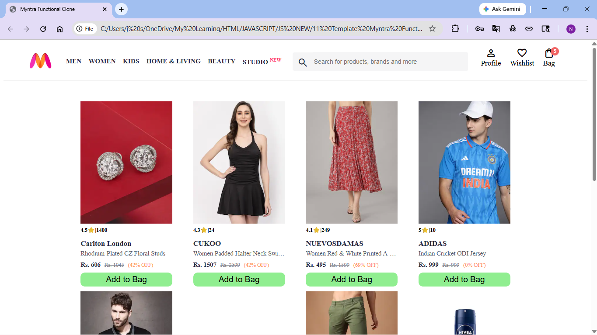
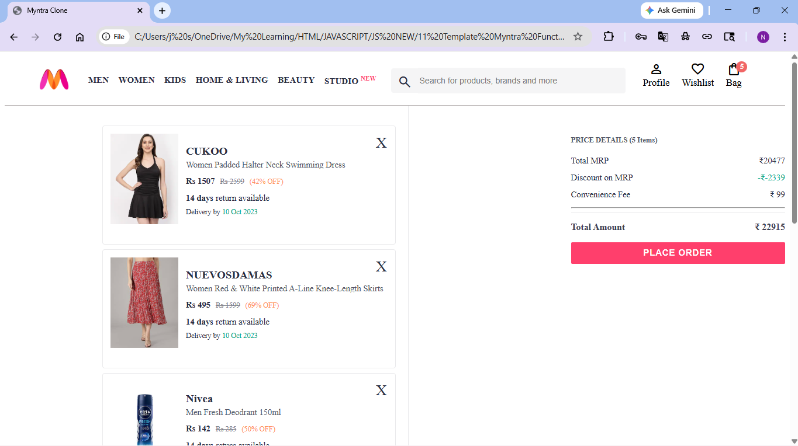

# 🛒 Myntra Functional Clone

A basic e-commerce web app inspired by Myntra, built using HTML, CSS, and JavaScript.

## 🚀 Features

- Product listing (dynamic rendering)
- Add to bag functionality
- Remove items from bag
- Real-time cart updates
- Data persistence using localStorage

## 🛠️ Tech Used

- HTML
- CSS
- JavaScript

## 📸 Screenshots

### Homepage

### Cart Page

## ▶️ How to Run

1. Download or clone the repository  
2. Open `index.html` in your browser  

## 📌 Learnings

- DOM manipulation at scale  
- Working with arrays and objects  
- Handling multi-page interactions  
- Using localStorage for persistence  

---

Made by Vikash
